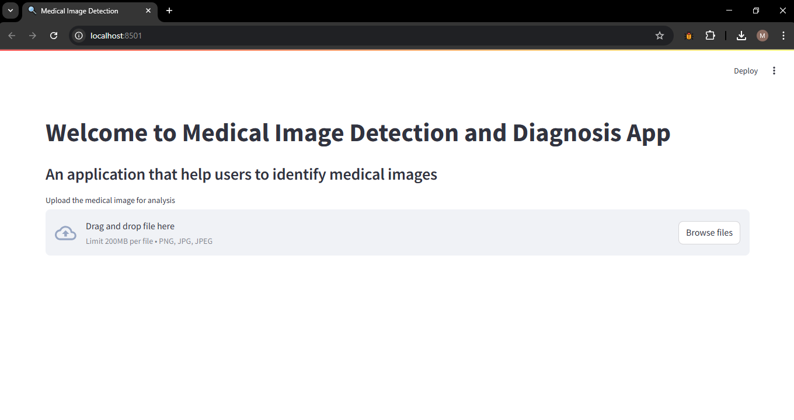

# Medical Image Detection and Diagnosis App


## 🚀 Overview
This is a **Medical Image Detection and Diagnosis App** built using **Streamlit** and **Google Gemini AI API**. The app allows users to upload medical images (**JPEG, PNG, JPG**) and receive AI-generated insights.

## ✨ Features
- 📷 Upload **medical images** (JPG, PNG, JPEG)
- 🤖 Uses **Google Gemini AI** for analysis
- 📊 Displays AI-generated **diagnostic results**
- 🔥 Simple & interactive **Streamlit UI**

## 🛠️ Tech Stack
- **Python**
- **Streamlit** (Frontend)
- **Google Gemini AI** (Backend for Image Processing)

## 📸 Demo


## ⚙️ Installation

### **1️⃣ Clone the Repository**
```bash
 git clone https://github.com/your-username/your-repo-name.git
 cd your-repo-name
```

### **2️⃣ Create a Virtual Environment (Recommended)**
```bash
python -m venv venv  # Create virtual environment
source venv/bin/activate  # Mac/Linux
venv\Scripts\activate  # Windows
```

### **3️⃣ Install Dependencies**
```bash
pip install -r requirements.txt
```

### **4️⃣ Set Up API Key**
Create a file named **`api_key.py`** and add:
```python
API_KEY = "your-google-gemini-api-key"
```

### **5️⃣ Run the App**
```bash
streamlit run app.py
```

## 📌 Usage
1. Upload a medical image (JPG, PNG, JPEG)
2. Click **Analyze Image**
3. Get AI-generated diagnostic insights

## 🔍 Example Output
```
AI Analysis Result:
- Possible Condition: Pneumonia
- Confidence: 92%
- Suggested Next Steps: Consult a doctor, perform further tests
```

## 📜 Folder Structure
```
📂 Medical-Image-Detection-App
├── 📜 app.py                # Main application file
├── 📜 api_key.py            # API Key configuration
├── 📜 requirements.txt      # Dependencies
├── 📜 README.md             # Project documentation
└── 📂 genai/                # Google Generative AI integration
```

## 🤝 Contributing
Pull requests are welcome! If you have suggestions or find issues, feel free to open an issue.

## 📝 License
This project is **open-source** under the **MIT License**.

---
### ⭐ Don't forget to star the repo if you like it! ⭐

